# Phase 01 — Enforcement and permissions

**Status:** Documentation for the enforcement slice. Implementation is not complete.  
**Scope:** Make the existing Security Control Center enforce identity, tenant, role, permission, resource scope, blocklist, and audit.  
**Out of scope:** A new application, mock telemetry, and every later phase listed in the boundary diagram.

This document does not replace [`SECURITY_CONTROL_CENTER_PLAN.md`](./SECURITY_CONTROL_CENTER_PLAN.md). It draws only the Phase 01 gate that every security-sensitive action must pass.

PostgreSQL is the source of truth for identity, membership, roles, permissions, the blocklist, and the audit log. Redis (`src/auth/rate-limit-redis.ts`) rate-limits requests. It does not decide authorization, and it does not store the blocklist or the audit log.

---

## 1. Phase 01 boundary

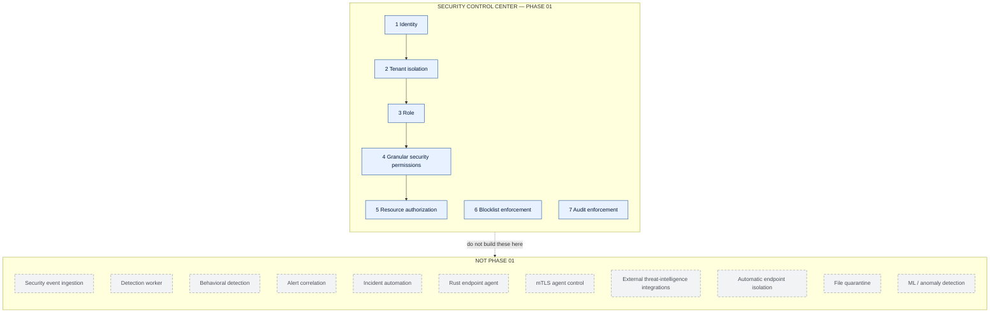

Routes that already exist for events, rules, and honeypots stay as they are. Phase 01 does not extend them into a pipeline, a worker, or an agent. The staff permission gate on those routes is in scope, because an unenforced route is an authorization hole, not a future detector.

---

## 2. Main enforcement flow

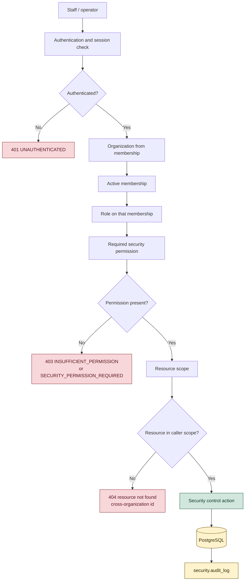

Denial codes stay distinct. A missing session is 401. A known user without the permission is 403. An id that is not in the caller's organization is 404, via `NotFoundError` in `src/security/postgres-store.ts`, so the API does not confirm that another tenant's row exists.

`UnauthorizedError` is HTTP 401. `ForbiddenError` is HTTP 403. `NotFoundError` is HTTP 404. Defined in `src/http/errors.ts`.

---

## 3. Layer 1 — Identity

The browser is not the source of identity.

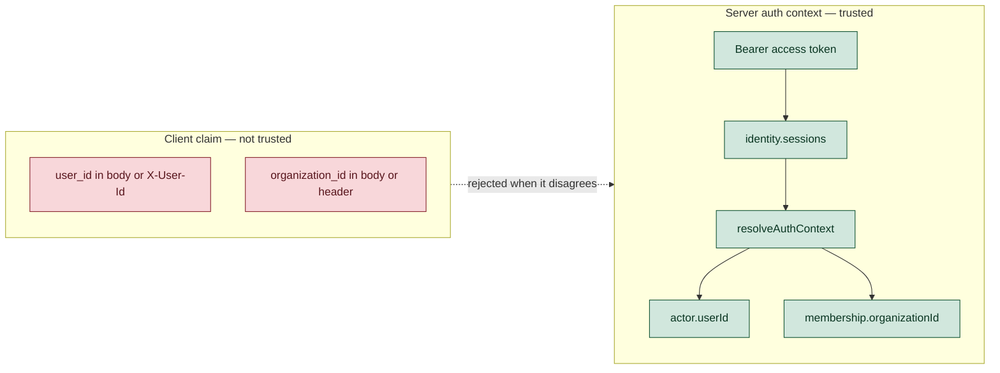

`createAuthMiddleware` (`src/auth/middleware.ts`) verifies the bearer token, requires `sessionId`, loads the session, then calls `resolveAuthContext(verified.userId)`. `rejectClientUserOverride` (`src/auth/account.ts`) rejects `X-User-Id` when it does not match `actor.userId`.

`rejectClientOrganizationOverride` (`src/authorization/organization.ts`) exists for other products. Security routes do not call it. They also do not read an organization id from the body. The store receives `auth.membership.organizationId` from `requireProductOrg` / `requireSecurityPermission`. A client-supplied organization id on a security route is ignored today, which is safe only while every handler keeps doing that. Phase 01 should call `rejectClientOrganizationOverride` on security writes so a mismatched body fails closed instead of being silently dropped.

---

## 4. Layer 2 — Organization / tenant isolation

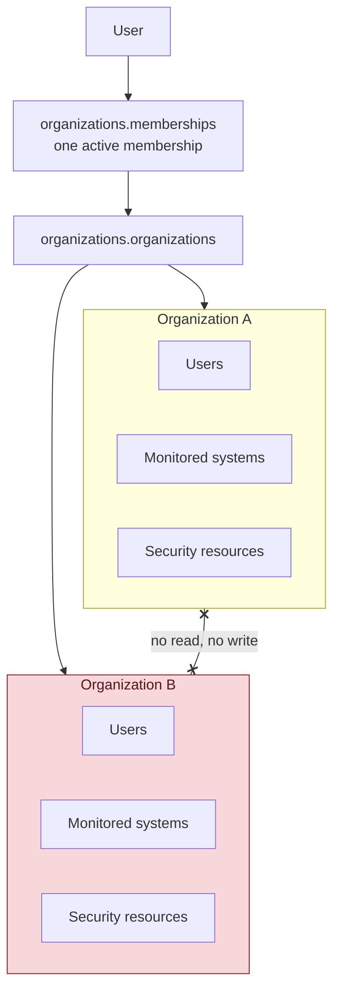

`resolveAuthContext` (`src/auth/resolve-context.ts`) joins `identity.users` to one active `organizations.memberships` row, then `organizations.roles` and `organizations.organizations`. Two active memberships raise `403 MULTIPLE_ACTIVE_MEMBERSHIPS`. No membership raises `403 NO_ORGANIZATION_MEMBERSHIP`.

Security queries take that organization id as `$1`. Loading a system, incident, alert, or blocklist row uses `organization_id` and `id` together. A miss raises `NotFoundError` (404).

---

## 5. Layer 3 — Role

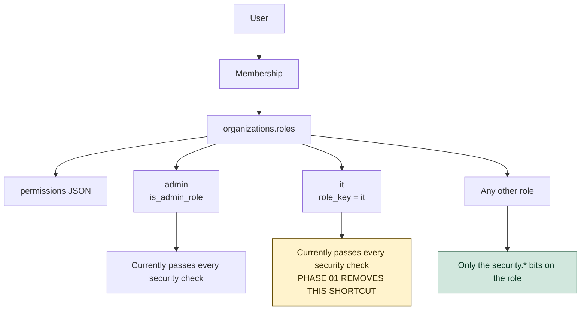

Permissions ride on the role, not on a flag the client sends. `hasPermission` (`src/authorization/permissions.ts`) reads nested JSON such as `{ "security": { "view": true } }` and also honors `"*"` and `true`.

Phase 01 does not treat `role_key === 'it'` as a security administrator. Today `isSecurityStaff` (`src/products/staff.ts`) returns true for an admin role, **or** `role_key === 'it'`, **or** `security.manage`. `canSecurity` returns true immediately when `isSecurityStaff` is true, so the specific permission passed by the route is never evaluated for those callers.

Migration `0048_security_control_center.sql` also writes every security bit, including `contain` and `manage`, onto both `admin` and `it`. Removing only the `role_key` shortcut leaves the seeded JSON in place. Both have to change before an IT user can be limited to view and investigate.

Admin keeps full security access through `is_admin_role` and the seeded `security` object. That is the current administrator path. It is not a substitute for granting `it` the same path.

---

## 6. Layer 4 — Granular security permissions

These are the permissions already declared in `src/security/permissions.ts` and seeded in `0048_security_control_center.sql`. Phase 01 does not invent a new set.

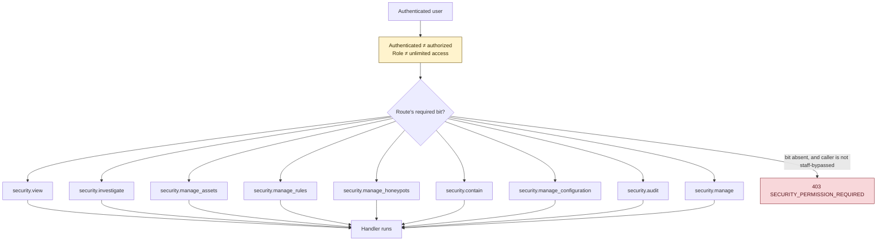

| Permission | What it is for | Routes that ask for it today |
|---|---|---|
| `security.view` | Read posture, projects, assets, honeypots, rules | `requireSecurityPermission(..., 'security.view')` |
| `security.investigate` | IP investigation, incident detail | same helper |
| `security.manage_assets` | Create projects and assets | same helper |
| `security.manage_honeypots` | Create honeypots | same helper |
| `security.contain` | Block and unblock an IP | same helper |
| `security.audit` | Read `security.audit_log` | same helper |
| `security.manage_rules` | Declared and seeded | **No route checks it.** `GET /rules` uses `security.view` |
| `security.manage_configuration` | Declared and seeded | **No route checks it.** System create, update, and token rotate use `authorize()` |
| `security.manage` | Broad grant | Checked only inside `isSecurityStaff`, which then skips every finer bit |

`authorize()` in `src/routes/security.ts` is a second gate. It only calls `isSecurityStaff`. These handlers use it and therefore do not check a specific bit: summary, events list, alerts, incidents, blocklist list, sessions, devices, login verifications, enrich IP, alert resolve, system list/create/update, token rotate.

`POST /api/security/events` calls `requireProductOrg` only. Any active member of the organization can write an event. That handler is an authorization gap on an existing route. Phase 01 closes the gate. It does not build an ingestion pipeline.

Until `canSecurity` stops returning true for every `it` user, the table above describes the intended check, not the effective check.

---

## 7. Layer 5 — Resource authorization

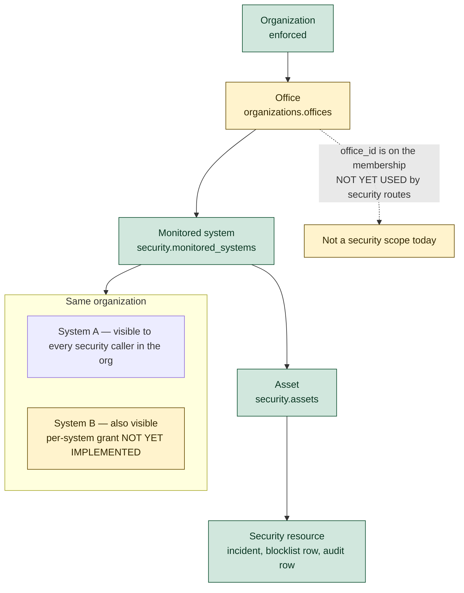

What is enforced: the organization predicate. Same organization plus a valid session does **not** imply a second organization's system. It **does** today imply every system, asset, and incident inside the caller's own organization. There is no per-system or per-office allow list in `src/routes/security.ts` or `src/security/postgres-store.ts`.

`membership.officeId` is loaded in `resolveAuthContext` from `organizations.offices`. Security authorization never reads it.

Phase 01 resource rule to implement before calling the phase complete:

- Cross-organization id: keep returning 404.
- Same organization: a security-sensitive action still checks the caller's permission, which is the resource boundary this phase actually has. Office-level and per-system grants are not invented in this phase unless a table and a check already exist. They do not. Do not pretend System B is hidden from a caller who holds `security.view` for the org.

The diagram shows System B as a future tighter scope so nobody confuses org isolation with per-system ACL. Completing Phase 01 does not require building that ACL. It requires not claiming it exists.

---

## 8. Denial paths

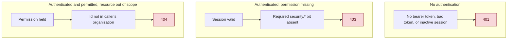

These are different failures. Collapsing them into 403 would tell a caller that another organization's resource exists.

---

## 9. Blocklist enforcement

A row in `security.blocklist` is not a control until login reads it.

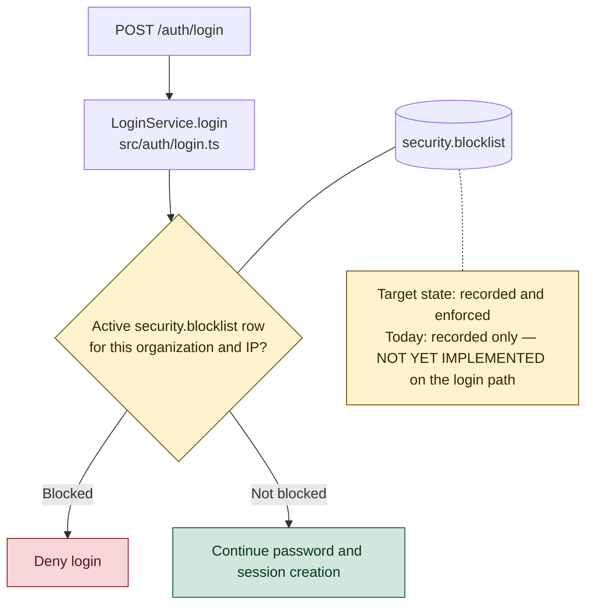

What exists:

- Table `security.blocklist` in `migrations/0041_security_center.sql` (`target_type` `ip` or `email`, `unblocked_at`, `expires_at`).
- `PostgresSecurityStore.blockIp` and `unblockIp`.
- `POST /api/security/blocklist` and `POST /api/security/blocklist/unblock`, gated by `security.contain`.
- `recordContainment` then `appendAudit` after the blocklist write.

What does not exist: any read of `security.blocklist` inside `LoginService.login`. A blocked IP can still complete login. Phase 01 adds that check before session creation, for an active row (`unblocked_at` is null, and `expires_at` is null or in the future) in the organization resolved for that account. The check fails closed for a listed IP. It does not depend on Redis.

---

## 10. Audit enforcement

Audit is part of the security action, not a screen the operator might open.

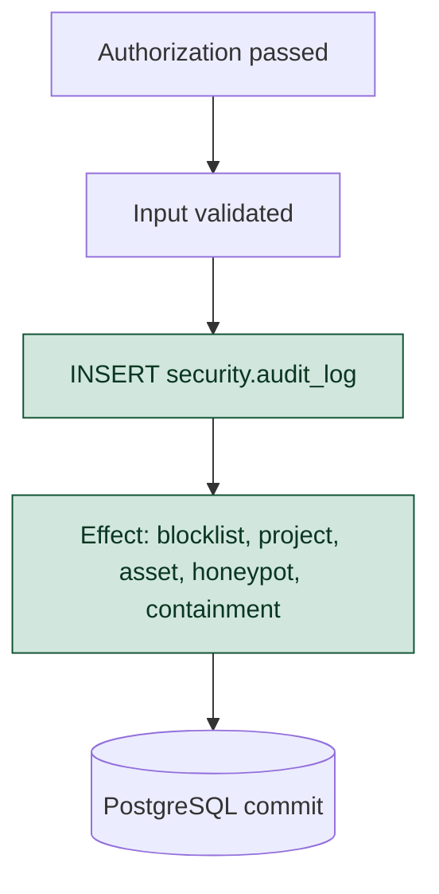

Target order is audit record, then effect, in one transaction. Current order is the opposite: `createProject`, `createAsset`, `createHoneypot`, and `recordContainment` insert the business row and then call `appendAudit`. `blockIp` does not audit by itself. The route audits only if `recordContainment` runs afterward. System create, system update, and token rotate do not call `appendAudit`.

`security.audit_log` (`0048_security_control_center.sql`) already has the fields Phase 01 needs:

| Concept | Column |
|---|---|
| Actor | `actor_user_id` |
| Organization | `organization_id` |
| Action | `action` |
| Target | `resource_type`, `resource_id` |
| Timestamp | `created_at` |
| Result | `resulting_state` (no separate result column) |
| Reason / context | `reason`, `previous_state`, `request_id`, `ip_address`, `user_agent`, `metadata` |

There is no application `UPDATE` or `DELETE` of this table. The migration comment says immutability is an application convention. The database role is not shown revoking `UPDATE` and `DELETE`. That grant change is part of finishing audit enforcement.

Failed attempts are not written. A denied permission does not currently append an audit row.

---

## 11. PostgreSQL in the Phase 01 path

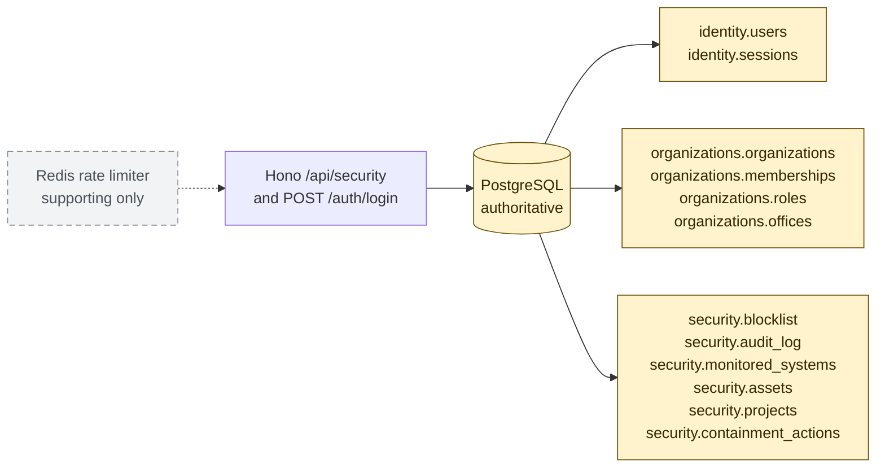

---

## 12. Core principle

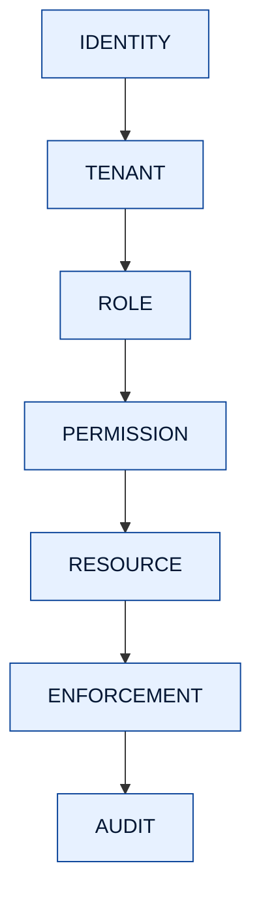

```text
AUTHENTICATED ≠ AUTHORIZED
AUTHORIZED ≠ AUTHORIZED FOR EVERY RESOURCE
RECORDED ≠ ENFORCED
```

The third line is the blocklist. A stored block that login never reads is a record, not an enforcement.

---

## 13. Legend

| Layer | Question it answers | Pass | Fail |
|---|---|---|---|
| Identity | Who is this caller? | Server-resolved user and session | 401 |
| Tenant | Which organization owns this session? | The one active membership | 403 if membership is missing, inactive, or ambiguous |
| Role | Which role document applies? | `organizations.roles` on that membership | No separate role error; a role with no bits fails the permission layer |
| Permission | May this role perform this action? | The specific `security.*` bit | 403 |
| Resource | Is this row inside the caller's scope? | Same `organization_id` as the membership | 404 |
| Blocklist | Is this login source blocked? | No active row | Login denied |
| Audit | Was the sensitive action recorded? | Row in `security.audit_log` for the same change | Action is incomplete |

Redis is supporting infrastructure for rate limits. It is outside the authoritative path.

---

## 14. Mapping to this repository

| Diagram piece | Implementation | State |
|---|---|---|
| Authentication / session | `createAuthMiddleware`, `getAuth` in `src/auth/middleware.ts`. Session check via `requireActiveSession`. Token verify via `CredentialVerifier`. | Implemented |
| Server-side identity | `resolveAuthContext` in `src/auth/resolve-context.ts` | Implemented |
| Reject browser user id | `rejectClientUserOverride` in `src/auth/account.ts`, called from the auth middleware | Implemented |
| Reject browser organization id | `rejectClientOrganizationOverride` in `src/authorization/organization.ts` | Implemented for work/org routes. **Not called from `src/routes/security.ts`.** Security handlers ignore a body organization id because they pass `membership.organizationId` into the store. |
| Tenant | `requireOrganizationId` / `requireProductOrg`. Store predicates `organization_id = $1` | Implemented |
| Role | `organizations.roles` joined in `resolveAuthContext`. Flags `isAdminRole`, `isManagerRole`, `roleKey` | Implemented |
| Permission helper | `hasPermission` in `src/authorization/permissions.ts`. `requireSecurityPermission` / `canSecurity` in `src/security/permissions.ts` | Helper exists. **Bypassed** when `isSecurityStaff` is true |
| IT is not a security admin | `isSecurityStaff` in `src/products/staff.ts`. Seed in `migrations/0048_security_control_center.sql` lines that update `role_key IN ('admin', 'it')` | **NOT YET IMPLEMENTED.** `it` is still a full security operator by role key and by seeded JSON |
| Broad route gate | Local `authorize()` in `src/routes/security.ts` | Exists and checks only `isSecurityStaff`. Specific bits are not applied on those routes |
| `security.manage_rules`, `security.manage_configuration` | Declared on `SecurityPermission` | **NOT YET IMPLEMENTED** as route checks |
| Cross-organization resource | `NotFoundError` after `WHERE organization_id = $1 AND id = $2` in `src/security/postgres-store.ts` | Implemented for system, incident, alert, blocklist, and related gets |
| Office scope | `membership.officeId` from `organizations.offices` | Loaded, **not used** by security authorization. Not a Phase 01 deliverable |
| Per-system ACL inside one org | No table and no check | **NOT YET IMPLEMENTED.** Not required to finish Phase 01. Must not be described as live |
| Blocklist storage | `security.blocklist`, `blockIp`, `unblockIp`, contain routes | Implemented |
| Blocklist at login | `LoginService.login` in `src/auth/login.ts` | **NOT YET IMPLEMENTED** |
| Audit write | `appendAudit` in `src/security/postgres-store.ts` | Implemented for project create, asset create, honeypot create, and containment |
| Audit before effect | Call order inside those methods | **NOT YET IMPLEMENTED.** Effect is inserted first |
| Audit on system and token changes | `createMonitoredSystem`, `updateMonitoredSystem`, `rotateIngestToken` | **NOT YET IMPLEMENTED** |
| Audit immutability in SQL | Comment on `security.audit_log` in `0048_security_control_center.sql` | Application avoids updates. **Grant revoke is not in the migration** |
| Redis | `src/auth/rate-limit-redis.ts` | Rate limits only. Not the source of truth |
| Staff API mount | `api.route('/security', createSecurityRoutes(...))` in `src/app.ts`, behind `createAuthMiddleware` | Implemented |
| Ingest mount | `app.route('/api/security/ingest', ...)` outside the staff auth middleware | Exists. **Outside Phase 01.** Do not extend it in this phase |
| Tests already present | `tests/security-control-center.test.ts` covers unauthenticated 401, a member without security permission, and permission JSON nesting | Do not cover the `it` bypass, login blocklist, or audit order |

---

## 15. Gaps that must close before Phase 01 is complete

1. **`isSecurityStaff` treats `it` as a security administrator.** `canSecurity` returns true before the specific permission is read. An IT user therefore passes `security.contain` and `security.audit` without those bits mattering.
2. **`0048` seeds every security permission onto `it`.** Removing the role-key shortcut alone leaves the JSON grant. Phase 01 needs an explicit, smaller grant for `it` (view and investigate, unless an operator is given more on purpose) and must stop writing `contain`, `manage`, `manage_configuration`, and `audit` onto every IT role.
3. **Many staff routes use `authorize()` instead of `requireSecurityPermission`.** Summary, events, alerts, incidents, blocklist reads, system mutations, and token rotation ignore the granular bits.
4. **`security.manage_rules` and `security.manage_configuration` are never required by a route.**
5. **`POST /api/security/events` allows any organization member.** Close it with a real security permission. Do not add a new ingest design.
6. **Login does not read `security.blocklist`.** Blocking an IP from the desk does not stop `POST /auth/login`.
7. **Audit is written after the effect, and not at all for system create, system update, or token rotation.** Sensitive writes need an audit row in the same transaction. Denied high-risk attempts (contain, token rotate) should be auditable too.
8. **`security.audit_log` can still be updated or deleted by a database role that has those grants.** Phase 01 should revoke them for the runtime role.
9. **Security routes do not call `rejectClientOrganizationOverride`.** They are safe only by convention. A mismatched client organization id should 403.

Explicitly not a Phase 01 completion item: per-office security ACL, per-system ACL inside an organization, detection workers, agents, and external integrations.

---

## 16. Verification checklist

Use this against the running API and the tests. Do not add fixture attacks or fake telemetry to satisfy a box.

**Identity**

- [ ] Request to `GET /api/security/control-center` with no bearer token returns 401.
- [ ] `X-User-Id` that does not match the token's user returns 403 `USER_OVERRIDE_REJECTED`.
- [ ] A security write that includes a different `organization_id` returns 403 `ORGANIZATION_OVERRIDE_REJECTED` and does not create a row in the caller's org or the other org.

**Tenant**

- [ ] User in organization A receives 404 for organization B's system id, incident id, and blocklist target.
- [ ] The same user's list endpoints return only organization A rows.

**Role and permission**

- [ ] A member whose role JSON has no `security` object receives 403 on `GET /api/security/control-center`.
- [ ] A role with only `security.view` can read the control center and cannot `POST /api/security/blocklist` (403).
- [ ] A role with only `security.view` cannot `POST /api/security/systems` or rotate a token (403).
- [ ] An `it` role without `security.contain` in its JSON receives 403 on block and unblock.
- [ ] An `it` role with `security.view` and `security.investigate` can open the desk and an investigation.
- [ ] Admin still can perform contain and configuration.
- [ ] `POST /api/security/events` returns 403 for a member who lacks the security write permission you assign to that route.

**Blocklist**

- [ ] After `POST /api/security/blocklist` for an IP, `POST /auth/login` from that IP, for a user in that organization, is denied.
- [ ] After unblock, or after `expires_at` has passed, login from that IP proceeds through the normal password check.
- [ ] An IP blocked in organization A does not block a login whose membership is organization B.
- [ ] The login denial does not depend on Redis being the place the block is stored.

**Audit**

- [ ] Block, unblock, project create, asset create, honeypot create, system create, system update, and token rotate each insert one `security.audit_log` row with actor, organization, action, target, timestamp, and reason or resulting state.
- [ ] If the effect fails, there is no committed audit row that claims success, and there is no committed effect without an audit row.
- [ ] The runtime database role cannot `UPDATE` or `DELETE` `security.audit_log`.
- [ ] A failed contain attempt by a user who lacks `security.contain` is either rejected with 403 before any blocklist write, or recorded as a denial. It must not change `security.blocklist`.

**Boundary**

- [ ] This phase's diff does not add a detection worker, a Rust agent, an external integration client, automatic isolation, or quarantine execution.
- [ ] Existing tests in `tests/security-control-center.test.ts` still pass, and new tests cover the `it` permission split and the login blocklist check.
